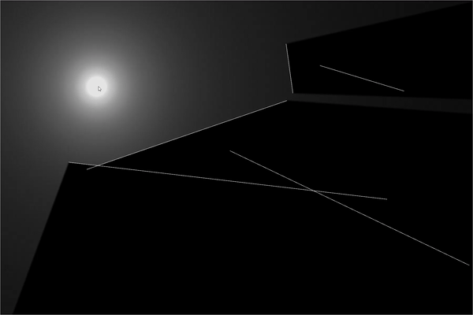

# Ray Casting

This is a basic 2d ray casting simulation using rust. The drawing was done with [`macroquad`](https://github.com/not-fl3/macroquad).




## Running

[Install rust](https://www.rust-lang.org/tools/install), clone this repo, then:
```powershell
cd ray_casting
cargo run --release
```